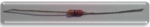
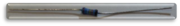
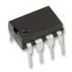

# Drawdio

# Material list

|  Components                                |            Quantity           |      Images      |
| -------------------------------------------|-------------------------------|------------------|
|    PCB Drawdio                             |               1               ||
|    Resistência 20MΩ (cores:vermelho/vermelho/azul/dourado/amarelo)        |               1               ||
|    Resistência 300kΩ  (cores:vermelho/branco/amarelo/laranja)                     |               1               ||
|    Resistência 10kΩ  (cores:castanho/preto/laranja/dourado)                      |               1               ||
|    Condensador 680pF  (código:DC481)       |               1               ||
|    Condensador 0.1uF (código:104)          |               1               ||
|    Oscilador TLC551                        |               1               ||
|    Condensador 100uF                       |               1               ||
|    Piezzo buzzer                           |               1               ||
|    Suporte 1 pilha AAA / AA                |               1               ||
|    Zip Tie                                 |               2               ||
|    Pionés                                  |               1               ||
|    Fita cobre (tamanho qb)                 |               1               ||
|	 Lápis									 |				 1				 ||
|    Pilha      							 |               1               ||

# Guia de montagem

1. Começa a soldar a resistência de 20MΩ. De seguida, a resistência de 300kΩ. Por fima resistencia de 10kΩ.

**Nota:** Consulta a lista de material para veres o código de cores de cada resistência.

2. Coloca o condensador de 680pF. Coloca o condensador de 0.1uF.

**Nota:** Consulta a lista de materila para veres como distinguir os condensadores.

3. Solda o oscilador TLC551

**Atenção!!!!:** Cuidado com a forma como colocas-a bola deverá ficar em concordância com o recorte da placa.

4. Solda na PCB o condensador de 100uF

**Atenção!!!!:** Não te esqueças que a **perna maior** sera a colocada no **+**.

5. Agora coloca o Piezo no local indicado na figura.

**Nota:** Não te preocupes com a orientação. Se tiveres dificuldade em soldar o Piezo pede ajuda.

6. Falta apenas colocar o suporte para as pilhas.

**Atenção!!!!:** Cuidado com forma como o colocas, a **espiral de GND**.

**Nota:** Se tiveres dificuldade em soldar o suporte das pilhas pede ajuda.

7. Coloca agora as braçadeitas para conseguires prender a PCB ao lápis.

8. Pegando na fita de cobre, cola uma das pontas na parte de cobre da PCB e a outra ponta cola no lápis(como podes ver na figura). De seguida coloca o pionés.

**Nota:** Se tiveres dificuldade em colocar o pionés pede ajuda.

9. Para reforçar o contacto, coloca a fita na horizontal do lápis (como podes ver na imagem).

10. Para terminares o Drawdio, basta colocares a fita de cobre na outra ponta da PCB e enrolares (como podes ver na imagem).

Com o Drawdio concluído já podes fazer "música" à vontade! Basta desenhares e divertires-te!
